# MicroTech Platform Architecture

## Overview

The MicroTech Platform is a modern, cloud-native application designed for professional FedRAMP proposal assistance and recruiting workflows. Built with enterprise-grade architecture principles, it provides scalable, secure, and maintainable solutions for complex document processing and AI-powered assistance.

## High-Level Architecture

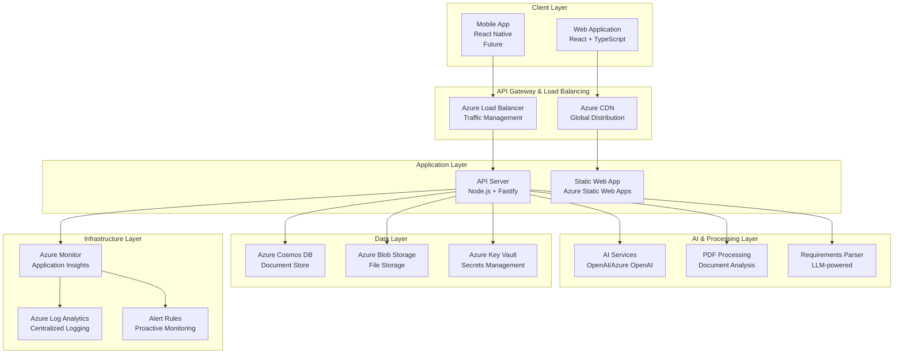

## Component Architecture

### Frontend Architecture

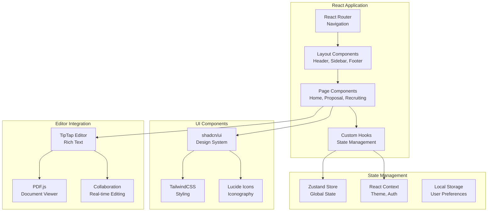

### Backend Architecture

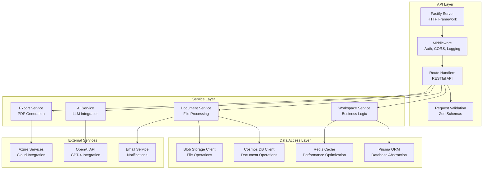

## Data Architecture

### Database Design

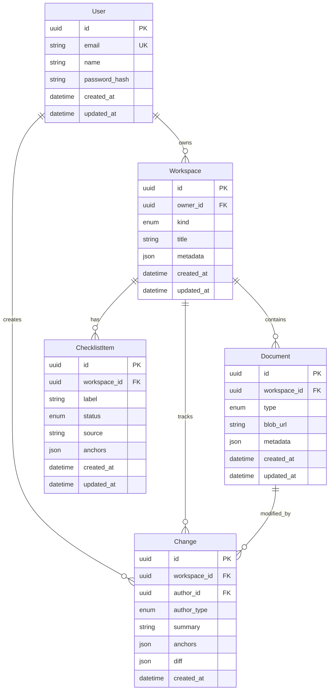

### Data Flow

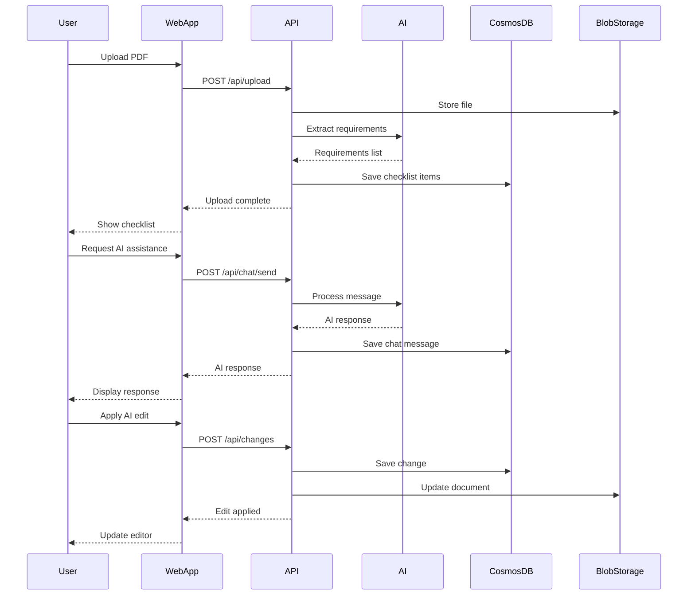

## Security Architecture

### Authentication & Authorization

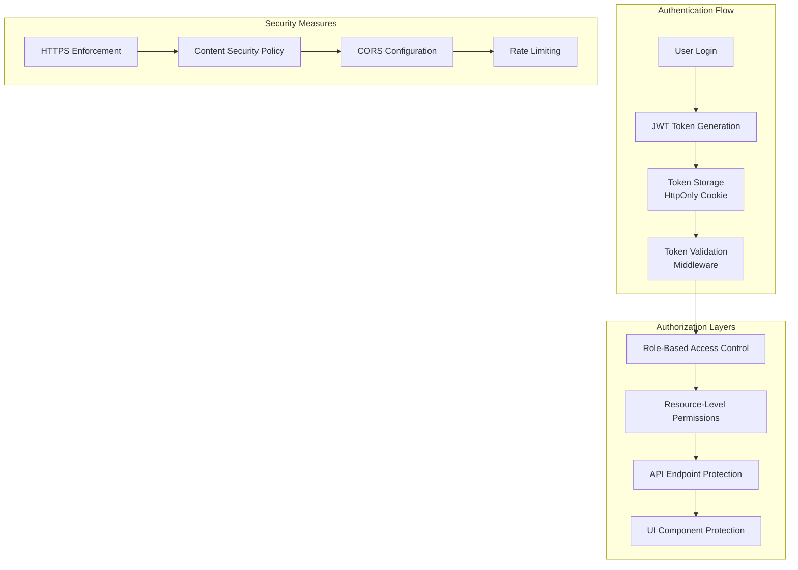

### Data Protection

```mermaid
graph TB
    subgraph "Encryption"
        REST[Encryption at Rest<br/>Azure Storage]
        TRANSIT[Encryption in Transit<br/>TLS 1.3]
        KEYS[Key Management<br/>Azure Key Vault]
        ROTATION[Key Rotation<br/>Automated]
    end
    
    subgraph "Access Control"
        IAM[Identity & Access Management]
        NETWORK[Network Security Groups]
        FIREWALL[Web Application Firewall]
        MONITORING[Security Monitoring]
    end
    
    subgraph "Compliance"
        AUDIT[Audit Logging]
        RETENTION[Data Retention Policies]
        BACKUP[Backup & Recovery]
        DISASTER[Disaster Recovery]
    end
    
    REST --> TRANSIT
    TRANSIT --> KEYS
    KEYS --> ROTATION
    IAM --> NETWORK
    NETWORK --> FIREWALL
    FIREWALL --> MONITORING
    AUDIT --> RETENTION
    RETENTION --> BACKUP
    BACKUP --> DISASTER
```

## Deployment Architecture

### Infrastructure as Code

```mermaid
graph TB
    subgraph "Infrastructure Provisioning"
        BICEP[Bicep Templates]
        PIPELINE[Azure DevOps Pipeline]
        RESOURCES[Azure Resources]
        CONFIG[Configuration Management]
    end
    
    subgraph "Application Deployment"
        BUILD[Build Pipeline]
        TEST[Testing Pipeline]
        DEPLOY[Deployment Pipeline]
        ROLLBACK[Rollback Strategy]
    end
    
    subgraph "Environment Management"
        DEV[Development Environment]
        STAGING[Staging Environment]
        PROD[Production Environment]
        MONITORING[Environment Monitoring]
    end
    
    BICEP --> PIPELINE
    PIPELINE --> RESOURCES
    RESOURCES --> CONFIG
    BUILD --> TEST
    TEST --> DEPLOY
    DEPLOY --> ROLLBACK
    DEV --> STAGING
    STAGING --> PROD
    PROD --> MONITORING
```

### CI/CD Pipeline

```mermaid
graph LR
    subgraph "Source Control"
        GIT[Git Repository]
        PR[Pull Request]
        MAIN[Main Branch]
    end
    
    subgraph "Build & Test"
        LINT[Code Linting]
        TEST[Unit Tests]
        BUILD[Build Artifacts]
        SECURITY[Security Scan]
    end
    
    subgraph "Deployment"
        STAGING[Staging Deploy]
        E2E[E2E Tests]
        PROD[Production Deploy]
        HEALTH[Health Checks]
    end
    
    GIT --> PR
    PR --> MAIN
    MAIN --> LINT
    LINT --> TEST
    TEST --> BUILD
    BUILD --> SECURITY
    SECURITY --> STAGING
    STAGING --> E2E
    E2E --> PROD
    PROD --> HEALTH
```

## Monitoring & Observability

### Application Monitoring

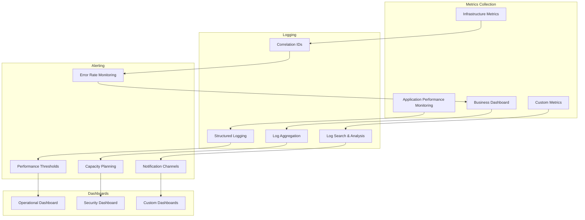

## Scalability & Performance

### Horizontal Scaling

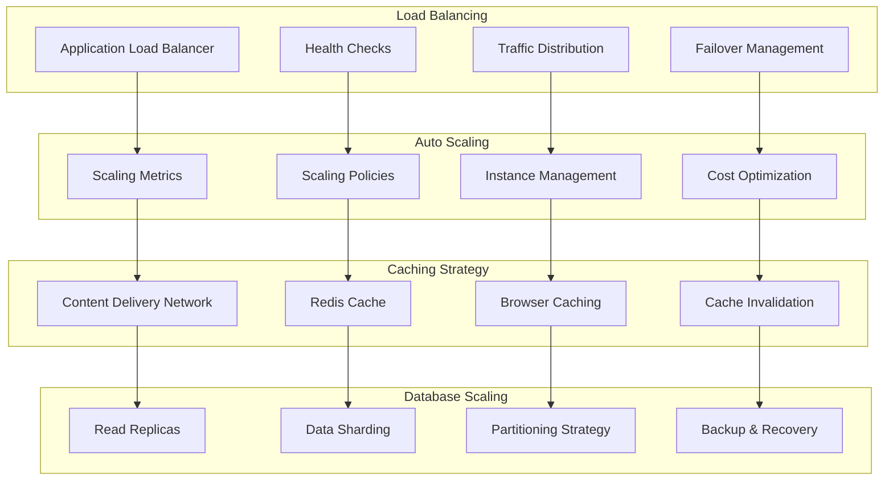

## Disaster Recovery

### Backup & Recovery Strategy

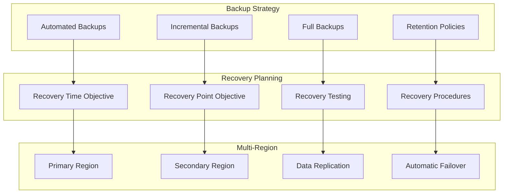

## Decision Records

### Architecture Decisions

| Decision | Date | Status | Rationale |
|----------|------|--------|-----------|
| ADR-001: Monorepo Structure | 2024-01-15 | Accepted | Improved developer experience, shared dependencies, simplified CI/CD |
| ADR-002: React + TypeScript Frontend | 2024-01-15 | Accepted | Type safety, developer productivity, ecosystem maturity |
| ADR-003: Node.js + Fastify Backend | 2024-01-15 | Accepted | Performance, TypeScript support, plugin ecosystem |
| ADR-004: Azure Cosmos DB | 2024-01-15 | Accepted | Global distribution, automatic scaling, multi-model support |
| ADR-005: Azure Blob Storage | 2024-01-15 | Accepted | Cost-effective file storage, CDN integration, security features |
| ADR-006: OpenAI GPT-4 Integration | 2024-01-15 | Accepted | State-of-the-art AI capabilities, API reliability, cost-effectiveness |
| ADR-007: Bicep for Infrastructure | 2024-01-15 | Accepted | Native Azure integration, type safety, maintainability |

### Technology Choices

#### Frontend Stack
- **React 18**: Modern component-based UI with concurrent features
- **TypeScript**: Type safety and improved developer experience
- **Vite**: Fast build tool with excellent developer experience
- **TailwindCSS**: Utility-first CSS framework for rapid UI development
- **shadcn/ui**: High-quality, accessible component library
- **Zustand**: Lightweight state management solution
- **React Router**: Declarative routing for single-page applications

#### Backend Stack
- **Node.js**: JavaScript runtime for server-side development
- **Fastify**: High-performance web framework with TypeScript support
- **Prisma**: Type-safe database ORM with excellent developer experience
- **Zod**: Runtime type validation and schema definition
- **Pino**: High-performance JSON logger
- **JWT**: Stateless authentication for scalable applications

#### Infrastructure Stack
- **Azure**: Comprehensive cloud platform with enterprise features
- **Bicep**: Infrastructure as Code with native Azure integration
- **GitHub Actions**: CI/CD pipeline automation
- **Azure Static Web Apps**: Serverless hosting for React applications
- **Azure App Service**: Managed hosting for API applications
- **Azure CDN**: Global content delivery for optimal performance

## Future Considerations

### Planned Enhancements

1. **Microservices Architecture**: Break down monolithic API into domain-specific services
2. **Event-Driven Architecture**: Implement event sourcing and CQRS patterns
3. **GraphQL API**: Add GraphQL layer for more flexible data fetching
4. **Real-time Collaboration**: WebSocket integration for live editing
5. **Advanced AI Features**: Custom model fine-tuning and specialized workflows
6. **Mobile Applications**: React Native apps for iOS and Android
7. **Enterprise Features**: SSO integration, advanced RBAC, audit trails

### Scalability Roadmap

1. **Phase 1**: Current monolithic architecture with horizontal scaling
2. **Phase 2**: Service-oriented architecture with API gateway
3. **Phase 3**: Microservices with event-driven communication
4. **Phase 4**: Multi-tenant architecture with tenant isolation
5. **Phase 5**: Global distribution with edge computing

---

This architecture document is living and will be updated as the platform evolves. For questions or clarifications, please contact the architecture team.
